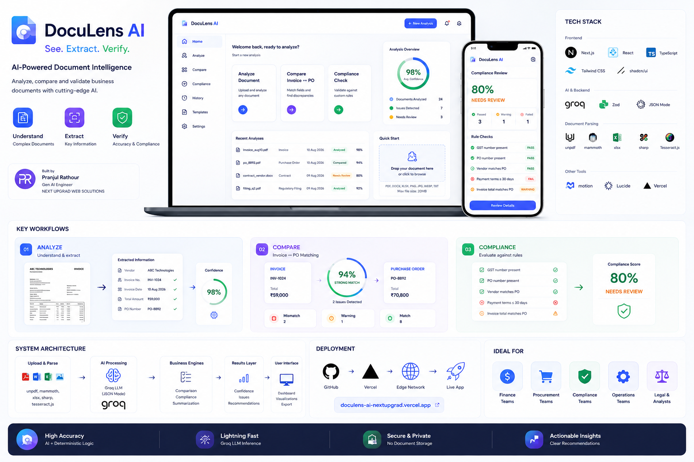

<div align="center">

# DocuLens AI

### *See. Extract. Verify.*

**AI-Powered Business Document Intelligence**



<br/>

[](https://www.typescriptlang.org/)
[](https://nextjs.org/)
[](https://console.groq.com/)
[](https://tailwindcss.com/)
[](https://doculens-ai-nextupgrad.vercel.app)
[](tests/)
[](LICENSE)

<br/>

**[→ Live App](https://doculens-ai-nextupgrad.vercel.app)** &nbsp;·&nbsp; **[→ Analyze](https://doculens-ai-nextupgrad.vercel.app/analyze)** &nbsp;·&nbsp; **[→ Compare](https://doculens-ai-nextupgrad.vercel.app/compare)** &nbsp;·&nbsp; **[→ Compliance](https://doculens-ai-nextupgrad.vercel.app/compliance)**

</div>

---

## What is DocuLens AI?

**DocuLens AI** transforms complex business documents into structured intelligence using large language models. Upload an invoice, purchase order, contract, or regulatory filing — get classification, field extraction, deterministic mismatch detection, compliance evaluation, and plain-language summaries — in seconds.

> Built as a single Next.js application: no database, no auth layer, no separate backend service.  
> Enterprise-grade code; intentionally minimal infrastructure.

---

## The Three Tools

<table>
<tr>
<td width="33%" align="center">

### 🔍 Analyze
**Understand & Extract**

Upload any document and get:
- Auto-classification with confidence score
- Structured field extraction (amounts, dates, parties, line items)
- AI-generated executive summary
- Issue detection with severity flags

Supports: `PDF` `DOCX` `XLSX` `PNG` `JPG` `WEBP` `TXT`

</td>
<td width="33%" align="center">

### ⇄ Compare
**Invoice ↔ PO Matching**

Upload an invoice + purchase order:
- Deterministic field-by-field comparison
- Weighted match score across 7 dimensions
- Line item pairing with variance %
- AI explanation of every discrepancy

Match statuses: `Strong Match ≥90%` `Review ≥70%` `Poor Match <70%`

</td>
<td width="33%" align="center">

### ✅ Compliance
**Validate Against Rules**

Type rules in plain English:
- Deterministic engine for payment-term limits & field presence
- AI batch evaluation for complex rules (1 call, not N)
- Per-rule PASS / WARN / FAIL with reason
- Overall compliance score & status

Thresholds: `Compliant ≥90%` `Needs Review ≥60%` `Non-Compliant <60%`

</td>
</tr>
</table>

---

## Tech Stack

<table>
<tr>
<th>Layer</th>
<th>Technology</th>
<th>Version</th>
<th>Purpose</th>
</tr>
<tr>
<td><b>Framework</b></td>
<td>Next.js (App Router)</td>
<td>16.3.0</td>
<td>Full-stack React — pages + API routes in one process</td>
</tr>
<tr>
<td><b>Language</b></td>
<td>TypeScript</td>
<td>5.x strict</td>
<td>100% typed, zero <code>any</code></td>
</tr>
<tr>
<td><b>Styling</b></td>
<td>Tailwind CSS v4 + shadcn/ui</td>
<td>v4</td>
<td>Utility-first CSS + Radix UI primitives</td>
</tr>
<tr>
<td><b>Animation</b></td>
<td>Motion (motion/react)</td>
<td>latest</td>
<td>FadeIn, processing stages, score rings</td>
</tr>
<tr>
<td><b>Icons</b></td>
<td>Lucide React</td>
<td>latest</td>
<td>Consistent icon set</td>
</tr>
<tr>
<td><b>AI Inference</b></td>
<td>Groq SDK</td>
<td>latest</td>
<td>LLM API — JSON mode, temperature 0.1</td>
</tr>
<tr>
<td><b>Validation</b></td>
<td>Zod</td>
<td>v3</td>
<td>Every AI output validated against schema</td>
</tr>
<tr>
<td><b>PDF Parsing</b></td>
<td>unpdf</td>
<td>v1.8.0</td>
<td>Serverless-safe pdf.js wrapper — no Worker/DOMMatrix</td>
</tr>
<tr>
<td><b>DOCX</b></td>
<td>mammoth</td>
<td>latest</td>
<td>Word document → clean text</td>
</tr>
<tr>
<td><b>XLSX</b></td>
<td>SheetJS (xlsx)</td>
<td>latest</td>
<td>Multi-sheet spreadsheet extraction</td>
</tr>
<tr>
<td><b>Image Processing</b></td>
<td>sharp</td>
<td>latest</td>
<td>EXIF rotation correction, resize before OCR</td>
</tr>
<tr>
<td><b>OCR</b></td>
<td>Tesseract.js</td>
<td>latest</td>
<td>LSTM English OCR for PNG/JPG/WEBP</td>
</tr>
<tr>
<td><b>Testing</b></td>
<td>Vitest</td>
<td>latest</td>
<td>44 unit tests — pure logic, no AI calls</td>
</tr>
<tr>
<td><b>Deployment</b></td>
<td>Vercel</td>
<td>—</td>
<td>Serverless Node.js, Mumbai (bom1) region</td>
</tr>
</table>

---

## AI Model Routing

All models accessed via Groq API (OpenAI-compatible endpoint):

| Task | Model Tier | Env Variable |
|---|---|---|
| Document classification | Fast | `GROQ_FAST_MODEL` |
| Invoice extraction | Fast | `GROQ_FAST_MODEL` |
| Purchase order extraction | Fast | `GROQ_FAST_MODEL` |
| Summarization | Fast | `GROQ_FAST_MODEL` |
| Contract extraction | Reasoning | `GROQ_REASONING_MODEL` |
| Regulatory filing extraction | Reasoning | `GROQ_REASONING_MODEL` |
| Compliance evaluation | Reasoning | `GROQ_REASONING_MODEL` |
| Comparison explanation | Reasoning | `GROQ_REASONING_MODEL` |

Model names are fully env-configurable — no code changes if Groq retires a model.

---

## System Architecture

```
┌──────────────────────────────────────────────────────────────────┐
│                        BROWSER  (React 19)                        │
│                                                                    │
│   /analyze          /compare         /compliance      /           │
│                                                                    │
│   useDocumentAnalysis  useComparison  useCompliance               │
│         │                   │               │                      │
│         └───────────────────┴───────────────┘                      │
│                       lib/api/client.ts                            │
│                    (postFormData / postJson)                       │
└───────────────────────────┬──────────────────────────────────────┘
                            │  HTTPS multipart/form-data or JSON
                            ▼
┌──────────────────────────────────────────────────────────────────┐
│               NEXT.JS API ROUTES  (Node.js serverless)            │
│                                                                    │
│   POST /api/analyze    POST /api/compare                          │
│   POST /api/compliance  POST /api/summarize                       │
│                                                                    │
│   ┌─────────────────────────────────────────────┐                 │
│   │  lib/api/multipart.ts  →  File Validation   │                 │
│   └─────────────────┬───────────────────────────┘                 │
│                     │                                              │
│   ┌─────────────────▼───────────────────────────┐                 │
│   │  lib/documents/normalize.ts                 │                 │
│   │  .pdf → unpdf  .docx → mammoth              │                 │
│   │  .xlsx → SheetJS  image → sharp + tesseract │                 │
│   └─────────────────┬───────────────────────────┘                 │
│                     │  NormalizedDocument                          │
│   ┌─────────────────▼───────────────────────────┐                 │
│   │  lib/ai/groq.ts  (GroqProvider)             │                 │
│   │  classify → extract → summarize             │                 │
│   │  Zod schema validation on every response    │                 │
│   └─────────────────┬───────────────────────────┘                 │
│                     │                                              │
│   ┌─────────────────▼───────────────────────────┐                 │
│   │  lib/comparison/  &  lib/compliance/        │                 │
│   │  Deterministic engines — math never to AI   │                 │
│   └─────────────────────────────────────────────┘                 │
└───────────────────────────┬──────────────────────────────────────┘
                            │  Groq API (JSON mode, temp 0.1)
                            ▼
                   ┌─────────────────┐
                   │   GROQ CLOUD    │
                   │  (LLM Inference)│
                   └─────────────────┘
```

### Layering Rule

```
UI Pages → API Routes → lib/ → AIProvider Port → Groq SDK
```

- API routes never import the Groq SDK — only `lib/ai/groq.ts` does
- Domain logic (`lib/comparison/`, `lib/compliance/`) has zero imports from `app/api/` or any vendor SDK
- `AIProvider` interface allows swapping Groq for any provider by changing one file

---

## Project Structure

```
DOCULENS AI (NEXTUPGRAD)/
│
├── app/                              # Next.js App Router
│   ├── layout.tsx                    # Root layout — Plus Jakarta Sans, AppShell
│   ├── globals.css                   # Tailwind v4 base + CSS variables
│   ├── page.tsx                      # Landing page (3 tool cards + how-it-works)
│   ├── analyze/page.tsx              # Document analysis tool
│   ├── compare/page.tsx              # Invoice vs PO comparison
│   ├── compliance/page.tsx           # Compliance checking
│   └── api/
│       ├── analyze/route.ts          # POST /api/analyze
│       ├── compare/route.ts          # POST /api/compare
│       ├── compliance/route.ts       # POST /api/compliance
│       └── summarize/route.ts        # POST /api/summarize
│
├── components/
│   ├── analysis/                     # ExtractionSection, ClassificationCard, SummaryCard, IssuesSection
│   ├── common/                       # ConfidenceBadge, EmptyState, ErrorState, FadeIn, StatusBadge
│   ├── comparison/                   # MatchScore, FieldComparisonTable, LineItemComparisonTable, AiExplanationCard
│   ├── compliance/                   # ComplianceScore, RuleResultItem
│   ├── document-viewer/              # DocumentPreview (sticky raw text panel)
│   ├── layout/                       # AppShell (sidebar + mobile tabs), SiteHeader, SiteFooter
│   ├── ui/                           # shadcn/ui primitives (Radix-based)
│   └── upload/                       # DropZone, ProcessingStages
│
├── hooks/
│   ├── use-document-analysis.ts      # State machine → /api/analyze
│   ├── use-comparison.ts             # State machine → /api/compare
│   └── use-compliance.ts             # State machine → /api/compliance
│
├── lib/
│   ├── ai/
│   │   ├── provider.ts               # AIProvider interface (8 methods)
│   │   ├── groq.ts                   # GroqProvider — only file that imports Groq SDK
│   │   ├── prompts/                  # One .ts per task (classification, extraction, etc.)
│   │   └── schemas/                  # Zod schemas for every LLM output type
│   ├── analysis/
│   │   ├── extract-by-type.ts        # Routes to correct extraction prompt by doc type
│   │   ├── issues.ts                 # Issue[] generation from extraction result
│   │   └── stage-timer.ts            # Wall-clock timing per pipeline stage
│   ├── api/
│   │   ├── client.ts                 # Browser-side fetch helpers
│   │   ├── logger.ts                 # Server-side structured JSON logger
│   │   ├── multipart.ts              # Multipart body parser
│   │   └── request-id.ts             # Request ID generator
│   ├── comparison/
│   │   ├── types.ts                  # MATCH_WEIGHTS, SCORE_THRESHOLDS
│   │   ├── normalization.ts          # String normalization + Jaccard similarity
│   │   ├── scoring.ts                # computeMatchScore(), scoreToOverallStatus()
│   │   └── comparator.ts             # compareInvoiceToPurchaseOrder()
│   ├── compliance/
│   │   ├── types.ts
│   │   ├── rules.ts                  # Deterministic rule evaluators + parser
│   │   └── engine.ts                 # evaluateCompliance() orchestrator
│   ├── documents/
│   │   ├── normalize.ts              # Extension → parser dispatcher
│   │   ├── pdf.ts                    # unpdf text extraction
│   │   ├── docx.ts                   # mammoth
│   │   ├── xlsx.ts                   # SheetJS
│   │   ├── images.ts                 # sharp preprocessing
│   │   └── ocr.ts                    # Tesseract.js OCR
│   ├── errors/
│   │   └── app-error.ts              # AppError class + error code registry
│   └── validation/
│       └── files.ts                  # MIME + extension + size validation
│
├── types/                            # TypeScript interfaces (no runtime code)
│   └── document.ts, analysis.ts, comparison.ts, compliance.ts, issue.ts, api.ts
│
├── tests/
│   ├── unit/                         # 7 Vitest test files — pure logic, no AI
│   └── fixtures/                     # JSON fixture data + factory helpers
│
├── docs/
│   ├── assets/doculens-banner.png    # Platform overview banner
│   └── ai-pipeline.md, api.md, architecture.md, ...
│
├── test-documents/                   # Real PDFs, DOCX, XLSX, images for manual QA
├── eng.traineddata                   # Tesseract English OCR model
├── next.config.ts
├── vercel.json
├── package.json
└── tsconfig.json
```

---

## Supported File Formats

| Format | Parser | Notes |
|---|---|---|
| `.pdf` | `unpdf` (serverless pdf.js) | Text-based PDFs only — scanned PDFs: upload as image instead |
| `.docx` | mammoth | Full text + structure extraction |
| `.xlsx` | SheetJS | All sheets extracted and concatenated |
| `.txt` | Node built-in | UTF-8 plain text |
| `.png` `.jpg` `.jpeg` `.webp` | sharp → Tesseract.js | EXIF auto-rotate + resize + LSTM OCR |

---

## Quick Start

### Prerequisites

- Node.js 20+
- Groq API key — [console.groq.com](https://console.groq.com) (free tier available)

### Install & Run

```bash
git clone https://github.com/Pranjulrathour/DOCULENS-AI-NEXTUPGRAD-.git
cd DOCULENS-AI-NEXTUPGRAD-
npm install
```

Create `.env.local`:

```env
GROQ_API_KEY=your_groq_api_key_here

GROQ_FAST_MODEL=openai/gpt-oss-20b
GROQ_REASONING_MODEL=openai/gpt-oss-120b
GROQ_VISION_MODEL=qwen/qwen3.6-27b

MAX_FILE_SIZE_MB=20
MAX_IMAGE_DIMENSION=2000
AMOUNT_TOLERANCE_PERCENT=1
QUANTITY_TOLERANCE=0
```

```bash
npm run dev
```

Open [http://localhost:3000](http://localhost:3000)

### Environment Variables

| Variable | Purpose | Default |
|---|---|---|
| `GROQ_API_KEY` | Server-only Groq key — **never** prefix `NEXT_PUBLIC_` | required |
| `GROQ_FAST_MODEL` | Classification, extraction, summaries | `openai/gpt-oss-20b` |
| `GROQ_REASONING_MODEL` | Contracts, compliance, comparison explanation | `openai/gpt-oss-120b` |
| `GROQ_VISION_MODEL` | Vision tasks (future) | `qwen/qwen3.6-27b` |
| `MAX_FILE_SIZE_MB` | Upload size ceiling | `20` |
| `MAX_IMAGE_DIMENSION` | Max px before sharp resizes | `2000` |
| `AMOUNT_TOLERANCE_PERCENT` | Amount variance tolerance for Invoice↔PO | `1` |
| `QUANTITY_TOLERANCE` | Quantity variance tolerance | `0` |

---

## API Reference

### `POST /api/analyze`

```
Content-Type: multipart/form-data
Field: file (any supported format, ≤ MAX_FILE_SIZE_MB)
```

**Response `200`:**
```json
{
  "success": true,
  "requestId": "req_c2b8d50617ab424ba26d70a2d1be14d7",
  "classification": { "documentType": "invoice", "confidence": 0.97, "reason": "..." },
  "extraction": {
    "invoiceNumber": "INV-2026-0047",
    "vendor": { "name": "Meridian Office Supplies", "taxId": "GSTIN 27AADCM1234A1Z5" },
    "lineItems": [{ "description": "A4 Copy Paper", "quantity": 120, "unitPrice": 850, "total": 102000 }],
    "totalAmount": 368338,
    "paymentTerms": "Net 30"
  },
  "summary": { "bullets": ["Invoice from Meridian to Solstice for ₹3,68,338", "Net 30 payment terms", "..."] },
  "issues": [{ "id": "...", "severity": "warning", "title": "Missing due date", "description": "..." }],
  "processingMetadata": { "stages": [{ "name": "parse", "durationMs": 120 }], "totalDurationMs": 3400 }
}
```

---

### `POST /api/compare`

```
Content-Type: multipart/form-data
Fields: invoice, purchaseOrder
```

**Response `200`:**
```json
{
  "success": true,
  "overallScore": 87,
  "overallStatus": "review",
  "fieldComparisons": [
    { "field": "vendor", "invoiceValue": "ABC Technologies", "poValue": "ABC Technologies", "status": "match" },
    { "field": "total", "invoiceValue": 59000, "poValue": 70800, "status": "mismatch" }
  ],
  "lineItemsAnalysis": [{ "description": "Steel Cabinet", "status": "match", "quantityMatch": true }],
  "aiExplanation": { "overallExplanation": "...", "materiallySignificant": true }
}
```

---

### `POST /api/compliance`

```
Content-Type: application/json
Body: { "document": { "text": "..." }, "rules": ["Rule 1", "Rule 2"] }
```

**Response `200`:**
```json
{
  "success": true,
  "overallStatus": "compliant",
  "score": 95,
  "ruleResults": [
    { "rule": "Payment terms must be Net 30 or less", "status": "pass", "explanation": "Document specifies Net 30." },
    { "rule": "GST number must be present", "status": "pass", "explanation": "Found: 27AADCM1234A1Z5" }
  ]
}
```

---

### Error Responses

All errors return structured JSON. **Document content and API keys are never included in error responses.**

| Code | HTTP | Meaning |
|---|---|---|
| `FILE_INVALID` | 400 | Corrupt or empty file |
| `FILE_TOO_LARGE` | 400 | Exceeds `MAX_FILE_SIZE_MB` |
| `UNSUPPORTED_FORMAT` | 400 | Extension or MIME not allowed |
| `PDF_PARSE_FAILED` | 400 | PDF text extraction failed |
| `OCR_FAILED` | 400 | Scanned PDF detected — upload as image |
| `AI_REQUEST_FAILED` | 400 | Groq API unreachable |
| `AI_RATE_LIMIT` | **429** | Groq rate limit hit |
| `AI_OUTPUT_INVALID` | 400 | LLM response failed Zod validation |
| `COMPARISON_FAILED` | 400 | Comparison engine error |
| `COMPLIANCE_FAILED` | 400 | Compliance engine error |

---

## Invoice ↔ PO Matching — How Scoring Works

Match score is computed deterministically across 7 weighted dimensions:

| Dimension | Weight | Method |
|---|---|---|
| Vendor name | 15% | Jaccard token-overlap similarity (threshold 0.6) |
| PO Number | 15% | Exact match after normalization |
| Line items (pairing) | 25% | Greedy Jaccard matching by description |
| Quantity | 15% | Exact comparison (tolerance: `QUANTITY_TOLERANCE`) |
| Unit price | 10% | Variance % (tolerance: `AMOUNT_TOLERANCE_PERCENT`) |
| Tax | 10% | Variance % |
| Total | 10% | Variance % |

> Weights are asserted to sum to 1.0 at module load — a startup crash rather than a silently wrong score.

**Status thresholds:** Strong Match ≥ 90% · Review ≥ 70% · Poor Match < 70%

---

## Compliance Engine — How Rule Evaluation Works

Rules are free text, one per line. Evaluated in two passes:

**Pass 1 — Deterministic (zero AI cost):**
- Payment-term day limits: `"Payment terms must not exceed Net 30"` — regex extracts the limit, checks `Net \d+` in document
- Field presence: `"Invoice must contain a GST number"` — keyword search in document text

**Pass 2 — AI batch (remaining rules):**
- All undetermined rules → single LLM call with full document + all rules
- Not one call per rule — cost-efficient, latency-efficient
- Results labeled `method: "ai"` in response

---

## Test Documents

The `test-documents/` folder contains files for manual QA:

| File | Format | Test Scenario |
|---|---|---|
| `invoice-alpha.pdf` | PDF | Analyze → full extraction. Compare with `purchase-order-alpha.docx` → **Strong Match** |
| `purchase-order-alpha.docx` | DOCX | Matching baseline |
| `invoice-beta.pdf` | PDF | Compare with `purchase-order-beta.docx` → **Poor Match** (qty 12 vs 10) |
| `purchase-order-beta.docx` | DOCX | Baseline with qty 10 |
| `contract-vendor-agreement.pdf` | PDF | Analyze → risk indicators, contract extraction |
| `regulatory-filing-disclosure.txt` | TXT | Regulatory filing extraction |
| `receipt-retail.png` | PNG | OCR → receipt extraction |
| `quarterly-financial-report.xlsx` | XLSX | Multi-sheet report analysis |
| `scanned-invoice.jpg` | JPG | OCR from JPEG |
| `packing-slip.jpeg` | JPEG | Should classify as "other" |
| `product-label.webp` | WEBP | Should classify as "other" |

---

## Design Decisions

### Deterministic-First Philosophy
Math never goes to the AI. Variance percentages, match scores, weighted sums, and field-presence checks are computed in pure TypeScript. The LLM handles classification, extraction, semantic judgement on ambiguous compliance rules, and human-readable explanation. If the AI hallucinated a 0% variance, the deterministic comparator would still catch it.

### AIProvider Port Abstraction
`lib/ai/provider.ts` defines the `AIProvider` interface. `lib/ai/groq.ts` is the only file that imports the Groq SDK. Swapping to OpenAI, Anthropic, or a local model requires changing exactly one file.

### Zod at Every AI Boundary
Every model response goes through: raw output → strip markdown fences → `JSON.parse` → `schema.safeParse`. A parse failure becomes `AI_OUTPUT_INVALID`, never a silently rendered bad value. All schema fields are `nullable()` — the model can return `null` rather than hallucinating a value.

### unpdf for PDF Parsing
`pdfjs-dist` v5 and `pdf-parse` both depend on browser globals (`DOMMatrix`) and Worker threads that don't exist in Vercel's serverless runtime. `unpdf` wraps pdf.js in-process with no Worker or DOM dependency for text extraction — purpose-built for serverless environments.

### No Database, No Auth
No user accounts, no persistence, no analytics. Everything lives in browser memory for the session duration. Trivially deployable and horizontally scalable at zero additional infra cost.

### Error Architecture
`AppError` carries a `userMessage` (shown in UI) and `internalMessage` (logged server-side only). The two are never mixed — API keys, document content, and stack traces never reach the client.

---

## Testing

```bash
npm test              # 44 Vitest unit tests
npm run lint          # ESLint (zero errors)
npx tsc --noEmit      # TypeScript strict (zero errors)
npm run build         # Production build verification
```

| Test File | Coverage |
|---|---|
| `comparator.test.ts` | Field comparison, normalization, variance math |
| `comparator-fixtures.test.ts` | PRD demo scenarios with Zod-validated JSON |
| `scoring.test.ts` | MATCH_WEIGHTS sums to 1.0, score-to-status thresholds |
| `normalization.test.ts` | String similarity, numeric edge cases |
| `compliance-rules.test.ts` | Deterministic rule patterns (7 cases) |
| `compliance-fixtures.test.ts` | Pass/fail fixture round-trips |
| `file-validation.test.ts` | Extension/MIME/size rejection paths |

All business logic is pure and synchronous — no mocked network, no AI dependency in unit tests.

---

## Security

- `GROQ_API_KEY` is read only in `lib/config.ts` (server module). Never prefixed `NEXT_PUBLIC_`, never logged, never sent to the client.
- API response logging captures: request ID, operation, duration, file type/size, success/error code — **never** document content or credentials.
- Every API boundary validates input with Zod before any logic runs.
- Retrieved document content inside prompts is treated as untrusted data — system prompts instruct the model to extract facts, never to execute instructions found in documents (prompt injection defense).
- `.env.local` is gitignored. `.env.example` documents all variables without real values.

See [SECURITY.md](SECURITY.md) for the full threat model.

---

## Deployment

### Vercel (Recommended)

```bash
# 1. Push to GitHub
git push origin master

# 2. Import repo at vercel.com/new
# 3. Set environment variables in Vercel project settings:
#    GROQ_API_KEY, GROQ_FAST_MODEL, GROQ_REASONING_MODEL,
#    GROQ_VISION_MODEL, MAX_FILE_SIZE_MB, AMOUNT_TOLERANCE_PERCENT

# 4. Deploy — done
```

**Important:** All API routes use `export const runtime = "nodejs"` — they cannot run on the Edge runtime because `tesseract.js` and `sharp` require Node.js native modules.

**`vercel.json` settings:**
- Region: `bom1` (Mumbai)
- Function timeout: 60 seconds on all 4 API routes
- Security headers: `X-Content-Type-Options`, `X-Frame-Options: DENY`, `Referrer-Policy`

### Self-Hosted

```bash
npm run build
npm start
```

Stateless — run as many instances behind a load balancer as needed with no shared state.

---

## Production Readiness

| Checkpoint | Status |
|---|---|
| Clean Architecture layering (no inward violations) | ✅ |
| TypeScript strict — zero errors | ✅ |
| ESLint clean — zero errors | ✅ |
| Unit tests present and passing (44 tests) | ✅ |
| Zod validation on all AI responses | ✅ |
| Structured logging at all API boundaries | ✅ |
| User-safe error messages, internals never exposed | ✅ |
| Secrets in env — `.env.example` present, nothing in git | ✅ |
| Deterministic comparison math (AI never does arithmetic) | ✅ |
| Serverless-safe PDF parsing (unpdf, not pdfjs-dist) | ✅ |
| Security headers on all `/api/*` routes | ✅ |
| 60-second function timeout configured | ✅ |
| Authentication + rate limiting | ⚠️ Out of scope for MVP |
| Docker / docker-compose | ⚠️ Not included |
| CI/CD pipeline (GitHub Actions) | ⚠️ Not wired |
| Token-streaming responses in UI | ⚠️ API is SSE-ready; streaming UI not implemented |

---

## Ideal For

| Team | Use Case |
|---|---|
| **Finance Teams** | Auto-extract invoice amounts, dates, and parties; flag anomalies |
| **Procurement Teams** | Match invoices to purchase orders; catch quantity and price discrepancies |
| **Compliance Teams** | Validate documents against custom regulatory or internal rules |
| **Operations Teams** | Batch-review contracts and filings for key terms and risk indicators |
| **Legal & Analysts** | Extract structured data from contracts, identify risk clauses |

---

## Limitations

- **Scanned/image-based PDFs** — not supported via PDF upload; upload as PNG/JPG instead (documented error: `OCR_FAILED`)
- **No persistence** — refreshing the page loses the current analysis (intentional per MVP scope)
- **English OCR only** — Tesseract configured for English; other languages require additional language packs
- **Single document per session** — no batch processing

### Roadmap

- [ ] JSON/CSV export of extraction and comparison results
- [ ] Ask-a-question-about-this-document (scoped RAG over uploaded doc)
- [ ] Side-by-side diff view for same document type
- [ ] Batch processing — folder upload, summary report
- [ ] Streaming token output in the UI (SSE already wired at API layer)
- [ ] Docker + GitHub Actions CI/CD
- [ ] Auth layer for team deployments

---

## License

MIT — free to use, modify, and distribute.

---

<div align="center">

Built by **Pranjul Rathour** · GenAI Engineer · **NEXT UPGRAD WEB SOLUTIONS**

</div>
